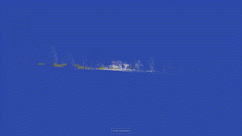
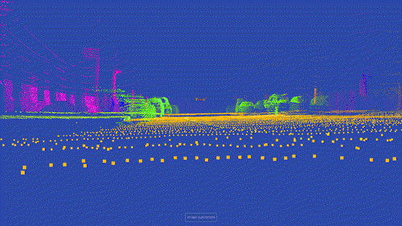
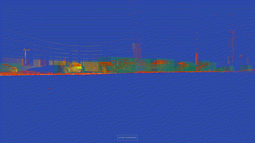

# ImmersivePoints

**Explore point clouds in 3D, including in VR and in Python**

ImmersivePoints is a Python package and web application that lets you visualize 3D point clouds in VR and Jupyter notebooks. Whether you're working with LiDAR data, 3D scans, ML embeddings, or any spatial data, ImmersivePoints makes it easy to see your data in an immersive, natural way.

[](https://opensource.org/licenses/MIT)
[](https://www.python.org/downloads/)

---

## Features

- **🎮 VR Visualization**: View point clouds in virtual reality (Oculus Quest, PC VR headsets)
- **📊 Jupyter Integration**: Render point clouds inline in notebooks with a single function call
- **🎨 Flexible Formats**: Support for XYZ, XYZI (with hue coloring), and XYZRGB point clouds
- **⚡ Fast**: Efficient binary format and Three.js renderer for smooth performance

---

## Gallery

<table>
  <tr>
    <td align="center">
      <br/>
      <b>Astyx LiDAR + Radar</b><br/>
      Automotive sensor fusion data
    </td>
    <td align="center">
      <br/>
      <b>PandaSet RGB</b><br/>
      Full-color urban scene
    </td>
    <td align="center">
      <br/>
      <b>Semantic Segmentation</b><br/>
      Labeled autonomous driving data
    </td>
  </tr>
</table>

[**→ View more examples on immersivepoints.com**](https://immersivepoints.com/)

## Examples

The [`examples/`](examples/) directory contains comprehensive tutorials:

### 📚 Tutorial Notebooks
- **[`inline_visualization.ipynb`](examples/inline_visualization.ipynb)** - Complete guide to Jupyter rendering
- **[`export_subsample.ipynb`](examples/export_subsample.ipynb)** - Subsample large point clouds
- **[`export_csv.ipynb`](examples/export_csv.ipynb)** - Load and export CSV data
- **[`export_ply.ipynb`](examples/export_ply.ipynb)** - Work with PLY 3D scan files
- **[`export_embeddings.ipynb`](examples/export_embeddings.ipynb)** - Visualize neural network embeddings

### 🚗 Autonomous Driving Examples
- **[`export_AEV_data.ipynb`](examples/export_AEV_data.ipynb)** - AEV self-driving car dataset
- **[`Astyx dataset lidar and radar.ipynb`](examples/Astyx%20dataset%20lidar%20and%20radar.ipynb)** - Sensor fusion visualization
- **[`Export PandaSet.ipynb`](examples/Export%20PandaSet.ipynb)** - PandaSet with semantic labels

---

## Supported Data Formats

ImmersivePoints supports three point cloud formats:

| Format | Columns | Description |
|--------|---------|-------------|
| **XYZ** | 3 | `[x, y, z]` - Positions only (auto-colored) |
| **XYZI** | 4 | `[x, y, z, hue]` - Positions + hue (0.0-1.0) |
| **XYZRGB** | 6 | `[x, y, z, r, g, b]` - Positions + RGB (0.0-1.0) |

All coordinates should be `float32` numpy arrays.


## Live Examples

Explore pre-loaded datasets:

- [Astyx LiDAR + Radar Fusion](https://immersivepoints.com/oculus.html?jsonb64=eyJwb2ludHMiOiBbeyJzb3VyY2UiOiAidXJsIiwgInVybCI6ICJodHRwczovL3BvaW50Y2xvdWR2aXN1YWxpemF0aW9uLnMzLmV1LWNlbnRyYWwtMS5hbWF6b25hd3MuY29tL2FzdHl4L2FzdHl4MDAwMDAwLnR4dC54eXpyZ2IiLCAidHlwZSI6ICJYWVpSR0IifV0sICJiYm94ZXMiOiBbeyJzb3VyY2UiOiAidXJsIiwgInVybCI6ICJodHRwczovL3BvaW50Y2xvdWR2aXN1YWxpemF0aW9uLnMzLmV1LWNlbnRyYWwtMS5hbWF6b25hd3MuY29tL2FzdHl4L2FzdHl4YmJveDAwMDAwMC50eHQuYmJveCJ9XX0=)
- [PandaSet RGB Point Cloud](https://immersivepoints.com/oculus.html?jsonb64=eyJwb2ludHMiOiBbeyJzb3VyY2UiOiAidXJsIiwgInVybCI6ICJodHRwczovL3BvaW50Y2xvdWR2aXN1YWxpemF0aW9uLnMzLmV1LWNlbnRyYWwtMS5hbWF6b25hd3MuY29tL3BhbmRhLWV4cG9ydC8wMjRfeHl6cmdiLm5weSIsICJ0eXBlIjogIlhZWlJHQiJ9XX0=)
- [PandaSet Semantic Segmentation](https://immersivepoints.com/oculus.html?jsonb64=eyJwb2ludHMiOiBbeyJzb3VyY2UiOiAidXJsIiwgInVybCI6ICJodHRwczovL3BvaW50Y2xvdWR2aXN1YWxpemF0aW9uLnMzLmV1LWNlbnRyYWwtMS5hbWF6b25hd3MuY29tL3BhbmRhLWV4cG9ydC8wMjRfeHl6aS5ucHkiLCAidHlwZSI6ICJYWVpJIn1dLCAiYmJveGVzIjogW3sic291cmNlIjogInVybCIsICJ1cmwiOiAiaHR0cHM6Ly9wb2ludGNsb3VkdmlzdWFsaXphdGlvbi5zMy5ldS1jZW50cmFsLTEuYW1hem9uYXdzLmNvbS9wYW5kYS1leHBvcnQvMDI0X2Jib3gubnB5In1dfQ==)
- [AEV Autonomous Driving](https://immersivepoints.com/oculus.html?name=e2652aab-4ace-4a09-86f4-374b23cb677b.xyzi)
- [Notre Dame 3D Scan](https://immersivepoints.com/oculus.html?name=d6263c4a-7121-432f-8712-b0de530a78ff.xyzrgb)
- [Brain Clustering Visualization](https://immersivepoints.com/oculus.html?name=77b04781-5d7c-445f-9e6a-65956758d644.xyzi)

---

## Documentation

For detailed documentation, see: (https://immersivepoints.com/)** - Live demos and upload tool

---

## VR Headset Support

ImmersivePoints works with:
- **Oculus Quest 1/2/3** (standalone)
- **Meta Quest Pro**
- **PC VR headsets** (Valve Index, HTC Vive, Oculus Rift, etc.)
- **Any WebXR-compatible browser**

---

## About the Creator

**Roland Meertens** is a robotics engineer and machine learning researcher with a passion for making data exploration more intuitive and accessible.

The story of ImmersivePoints began ~10 years ago when Roland was working on clustering algorithms for 3D brain data. Existing visualization tools were slow and uninformative, so he learned JavaScript to build better 3D visualizations. When Google launched Cardboard, he added VR support. Years later, when the Oculus Quest made untethered VR accessible, he finally realized his vision: walking freely through data in virtual reality.

**Website**: [pinchofintelligence.com](https://www.pinchofintelligence.com/)

---

## License

This project is licensed under the MIT License - see the [LICENSE](LICENSE) file for details.

---

## Citation

If you use ImmersivePoints in your research, please cite:

```bibtex
@software{immersivepoints2024,
  author = {Meertens, Roland},
  title = {ImmersivePoints: 3D Point Cloud Visualization in VR},
  year = {2024},
  url = {https://github.com/rmeertens/ImmersivePoints}
}
```
